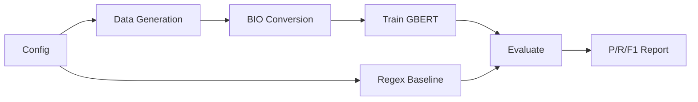

# Regulatory Reference Extraction (REG_ML)

A machine learning pipeline for extracting German legal references from regulatory text. The system uses a fine-tuned GBERT-Large model with BIO-tagged sequence labeling, evaluated against a regex baseline using entity-level metrics.

## Pipeline



**Config** loads hyperparameters from `config/default.yaml` with CLI overrides.
**Data Generation** (Phase 2) uses an LLM via OpenRouter to create labeled training samples.
**BIO Conversion** maps character-offset spans to B-REF/I-REF/O token labels.
**Train GBERT** (Phase 3) fine-tunes `deepset/gbert-large` for NER.
**Regex Baseline** provides the benchmark that the ML model must beat.
**Evaluate** computes entity-level Precision, Recall, and F1 via seqeval.

## Setup

### Requirements

- Python 3.10+
- pip

### Installation

```bash
# Clone the repository
git clone <repo-url>
cd REG_ML

# Install dependencies
pip install -r requirements.txt

# Set up environment variables
cp .env.example .env
# Edit .env and add your OpenRouter API key
```

### Configuration

All hyperparameters are in `config/default.yaml`. Override via CLI:

```bash
python scripts/evaluate.py model.use_crf=false training.batch_size=8
```

Key configuration sections:
- `project` — name, seed
- `device` — auto-detection (CUDA > MPS > CPU)
- `model` — GBERT settings, CRF toggle, LoRA
- `training` — batch size, learning rates, epochs
- `data` — sequence length, LLM model, cache paths
- `evaluation` — output directory

## Usage

### Run Regex Baseline Evaluation

```bash
PYTHONPATH=. python scripts/evaluate.py
```

Sample output:

```
Device: mps
Seed: 42

==================================================
  Regex Baseline Evaluation Report
==================================================

  Precision:  1.0000
  Recall:     1.0000
  F1-Score:   1.0000

  Detailed Report:
--------------------------------------------------
              precision    recall  f1-score   support
         REF       1.00      1.00      1.00         6
   micro avg       1.00      1.00      1.00         6
   macro avg       1.00      1.00      1.00         6
weighted avg       1.00      1.00      1.00         6

==================================================
```

## Project Structure

```
REG_ML/
├── config/
│   └── default.yaml           # All hyperparameters
├── src/
│   ├── __init__.py
│   ├── evaluation/
│   │   ├── __init__.py
│   │   ├── regex_baseline.py  # Regex-based reference extractor
│   │   ├── metrics.py         # BIO conversion + seqeval wrapper
│   │   └── evaluator.py       # Runs baseline and computes metrics
│   └── utils/
│       ├── __init__.py
│       ├── config.py          # OmegaConf config loader
│       └── device.py          # Device detection + seed setup
├── scripts/
│   └── evaluate.py            # CLI entry point for evaluation
├── data/
│   ├── gold_test/             # Gold test set (Phase 4)
│   └── cache/                 # Data generation cache
├── tests/
│   ├── conftest.py            # Shared fixtures
│   ├── test_config.py         # Config layer tests
│   ├── test_regex_baseline.py # Regex baseline tests (10 ref types)
│   ├── test_metrics.py        # BIO + seqeval tests
│   └── test_docs.py           # Documentation existence tests
├── requirements.txt
├── .env.example
└── README.md
```

## License

Internal PoC — not for public distribution.
